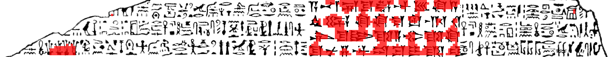

# Anomaly Detector

This Python module for computer vision anomaly detection identifies visual anomalies, meaning parts of an image that are unusual or outliers.  This is done with a model trained only on normal (non-anomalous) data.

## How to Use

```python
from anomaly import AnomalyDetector

ad = AnomalyDetector() # Create model
ad.train('example_dataset/train', 'example_dataset/val') # Train model
ad.save('example_dataset/model.pickle') # Save to disk

ad = AnomalyDetector.load('example_dataset/model.pickle') # Load from disk
ad.test('example_dataset/test', 'example_dataset/output') # Find anomalies!
```

`example_dataset/train`, `val`, and `test` are folders each containing one or more images for training, validation, and testing, respectively.  If you just have one image in a category, you can give its path instead of a folder.  The validation argument is optional.  If it's left out, the code will randomly assign your training images into training and validation.

In this example, it's unnecessary to load the model from disk (because it's still in memory from having just been created), but the line's there to show how to do it after the fact if needed.

The `AnomalyDetector()` call accepts many optional arguments to fine-tune the model's behavior; refer to the code for details.

## Example Dataset

The repo includes an example dataset with sketches of hieroglyphics.  By running `example_program.py` (reproduced above), we train a model on anomaly-free images then ask the model to find anomalies in the following image:


(Do you see the anomaly?  One section was pasted in from a different source.  In fact, that section's not hieroglyphics -- it's cuneiform.)

The program returns two files: `*_overlay.png` shows the image with anomalies highlighted in red, suitable for human viewing, and `*_mask.png` is a binary mask suitable for subsequent computer processing.




This program can be applied to many domains.  For example, we've found that it works well for analyzing sidescan sonar imagery.

## Algorithm

This code implements the algorithm from:

Napoletano, P., F. Piccoli, and R. Schettini, *Anomaly detection in nanofibrous materials by CNN-based self-similarity*.  *Sensors* **2018**, *18*, 209.

We are not affiliated with those authors, and no endorsement of this work by them is implied.

## License

The code is licensed under the Apache License 2.0.

Hieroglyphics imagery: Florida Center for Instructional Technology [ClipArt ETC](https://etc.usf.edu/clipart/52100/52136/52136_rosettastone.htm)

Cuneiform imagery: [Public domain](https://en.wikipedia.org/wiki/Cyrus_Cylinder#/media/File:Cyrus_cylinder_extract.svg)
